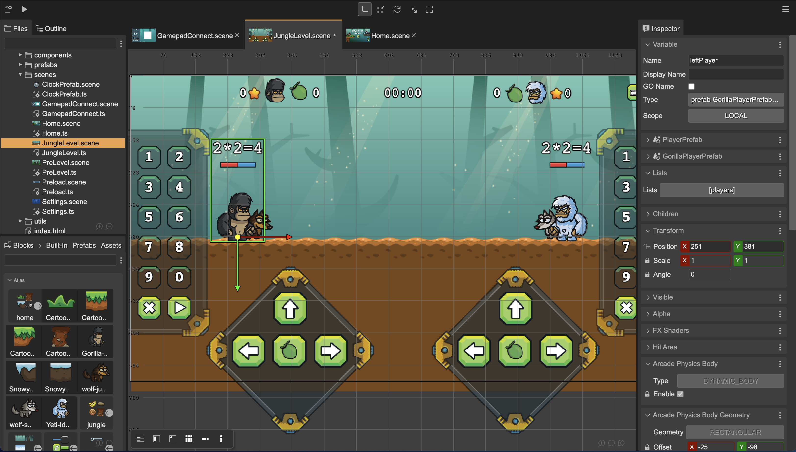
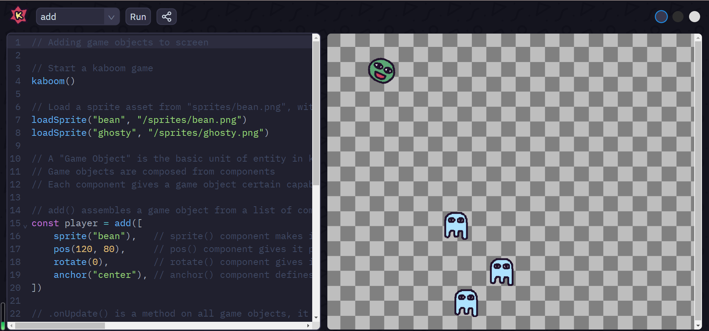

# Entry 1: Setting On My Tool & Project Idea For The Year-Long Freedom-Project
#### 10/28/2024

## Content: Setting On My Tool, Group & Project For My Freedom Project

The tool I decided on for this Freedom Project is **Phaser**. My backup tool is Kaboom.
I chose this topic because Phaser looks cooler than Kaboom. Phaser has components that almost looks like 3D, almost realistic and cute.

Even though, Kaboom's components can be editted but the things like sprites look like 2D and flat.

For this year's Year-Long Freedom Project, I wanted to work with someone else (as a team) because I don't want to work alone. Most importantly, I wanted to experience the skill of collaboration while working on this Freedom Project. I asked a lot of people but most of them wanted to work with someone else or they wanted to work alone. But on September 30, I founded someone that agreed to work with me. Simran Sayeed and Michelle Li said it's ok. After we confirmed on working together, we talked about it and we decided on making a math & music game. Simran Sayeed and I said we wanted to make a math & music game. Michelle Li said she wanted to make a game. Simran & I thought for a while and we thought of a game. We decided to make a game that have to do with Piano Tiles. But in order to play the music, we need to answer the math questions correctly. Simran Sayeed decided on the tool Earsketch. Michelle Li decided on the tool Anime.js. I decided on the tool Phaser. We will combine and use our tools to create our math & music game.

## Sources

My first resource is from my IDE/Github, where I stored & tinkered with my tool (tool folder): https://github.com/nancyc0337/sep11-freedom-project/tree/main/tool.

My second resource is from my IDE/Github, where I wrote down my progress of what I did with my tool: https://github.com/nancyc0337/sep11-freedom-project/blob/main/tool/learning-log.md.

My third resource is a website about Phaser: https://phaser.io/.

My fourth resource is a Phaser Tutorials playlist from Youtube that Mr. Mueller put in his document SEP11 Freedom Project Tool List: https://www.youtube.com/playlist?list%3DPLDyH9Tk5ZdFzEu_izyqgPFtHJJXkc79no.

## Engineering Design Process

Right now in the Engineering Design Process(EDP), I am on the 1st(Define the problem), 2nd(Research the problem), 3rd(Brainstorm possible solutions) and 4th step(Plan the most promising solution). Our 1st step was to decide ou what we would like to make for our Freedom Project. Then we decide on our groups, tool and backup tool. We tinker with the tool and confirm our tool. I think I'll be on 5th step(Create a prototype) to create our game.

## Skills

1) Collaboration

The 1st skill I learned during this process is **Collaboration**.

On September 30th, I decided to work with Simran Sayeed and Michelle Li. Simran Sayeed and Michelle Li have SEP during period 3. I have SEP during period 4. Even though we don't have the same class together, I can take this opportunity to learn the skill of **Collaboration** through pair programming and outside class communication.

2) Debugging, Embracing Failure, Attention to Detail, Growth Mindset

The 2nd, 3rd, 4th and 5th skill I learned during this process is **Debugging**, **Embracing Failure**, **Attention to Detail** and **Growth Mindset**.

From September 30 to October 27, I have tinkered with Phaser using [Phaser Tutorials playlist](https://www.youtube.com/playlist?list%3DPLDyH9Tk5ZdFzEu_izyqgPFtHJJXkc79no). While tinkering with Phaser in my IDE, I had a lot of problems & errors. I learned how to debug, embracing failure and pay attention to detail.

To debug, I can use `inspect` and go to the console to see if there's any output errors.

While tinkering with Phaser, I had a lot of problems, especially seeing my result, because at first I don't see anything, I just see a white screen. So I needed patience & perseverance to learn the tool. I had the courage to ask for help. I went over the [video](https://www.youtube.com/playlist?list%3DPLDyH9Tk5ZdFzEu_izyqgPFtHJJXkc79no) with my father to see the problems. Through asking for his help, I see my mistakes and see that I need to pay attention to detail.

One Example:

### 10/20/2024: Setting Up & Scenes

#### Part 2: Scenes

##### A-ha moments:
When I typed the code into the files scene1.js and scene2.js, and tried to switch scenes, the result didn't change. It just stayed as the 1st scene. After I watched the video again, I saw the problem. I didn't type `this.scene.start("playGame");` in scene1.js. I learned that this code helps the game jump from scene1 to scene2. Scene1 shows red background with white/transparent text saying "Loading game...". Scene 2 shows red background with "font: 25px, Arial" yellow text saying "Playing game".

Second Example:

### 10/27/2024:

#### Part 3: Game Objects Images

Link to the Video: https://youtu.be/l65rEEdgURA?si=1GlWWAUG16tk_4MT

Link to the Tinkering: https://github.com/nancyc0337/sep11-freedom-project/tree/main/tool/tinkering-2a

I tried to use a different image/background from the video.

The challenge that I had was uploading the background. At first I didn't see the background when I tried `http-server`. But after looking and tinkering with the codes, I see that the files game.js, scene1.js and scene2.js was the problem.

I learned to pay attention to detail, especially to my codes or I will not see my output/result that I wanted.

## Summary
In conclusion, I'm excited to learn more about Phaser to help make the math & music game with my groupmates(Simran Sayeed and Michelle Li).

We will create our name for our math & music game.

[Next](entry02.md)

[Home](../README.md)
