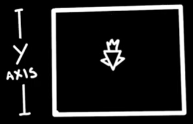
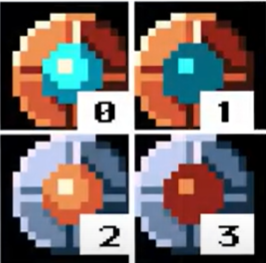
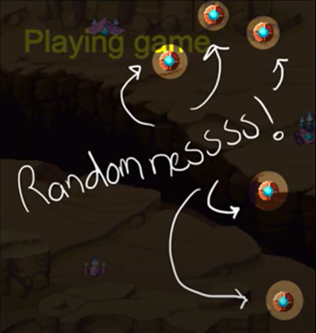
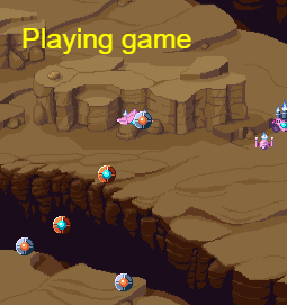
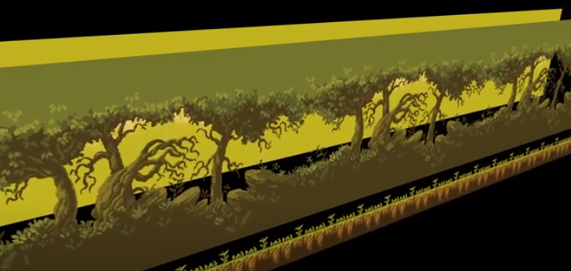

# Entry 2
##### 12/9/2024

## Content: Learning My Tool & Making My Freedom Project Goal For The Winter Break

From November 4 to December 8, I have been learning my tool **Phaser**. I used [this YouTube Tutorial](https://www.youtube.com/playlist?list%3DPLDyH9Tk5ZdFzEu_izyqgPFtHJJXkc79no). While watching the tutorials, I took notes and tinkered in my IDE.

### My Notes In My Learning Log

#### 11/11/2024

##### Part 4: Moving Images

Link to the video: [Part 4 Moving Images](https://youtu.be/jVlNZgX5fV8?si=8DX8YCn0WSZ5xWjU)

Link to the Tinkering: [Tinkering Number 3a](https://github.com/nancyc0337/sep11-freedom-project/tree/main/tool/tinkering-3a)

Notes:
* to move the sprite on the vertical axis, increase the Y value
* we can move the sprite back to the top of the screen when it reaches the bottom of the screen



* to make the background scroll more appealing, change the image to TileSprite
    * TileSprite is a sprite that has a repeating texture

Code Notes/Explanation:
```js
var randomX = Phaser.Math.Between(0, config.width);
alien.x = randomX;
```
This creates a random value between zero and the width of the game and assigns to the alien X value position

##### Part 5: Spritesheets

Link to the video: [Part 5 Spritesheets](https://youtu.be/U0K0YTifb1w?si=qKh0OpInCnVqsoFM)

Link to the Tinkering: [Tinkering Number 3b](https://github.com/nancyc0337/sep11-freedom-project/tree/main/tool/tinkering-3b)

What I made: when clicked, the aliens are destroyed => shows explosion

Notes:
* In order to make animations in Phaser, we need to use spritesheets
* A "Spritesheet" is a collection of images in a single file separated by frames
* Like in a movie cell, each frame has the same size as the previous one

Code Notes/Explanation:


* `Repeat` tells me how many times it will loop
 * infinite loops: use -1
* if we want the animation to disappear, we'll want it to run once
 * set the `Repeat` to 0 and set the `hideOnComplete` to true

###### Next Step
I will learn [Part 6 Physics](https://youtu.be/cuSQnbZloFc?si=PxrHsAOctcY3Ao1L).

#### 11/18/2024

##### Part 6: Physics

Link to the video: [Part 6 Physics](https://youtu.be/cuSQnbZloFc?si=PxrHsAOctcY3Ao1L)

Link to the Tinkering: [Tinkering Number 4a](https://github.com/nancyc0337/sep11-freedom-project/tree/main/tool/tinkering-4a)

Video Notes:
* physics engine is necessary for simulate gravity, velcity, collisions, etc

Code Notes:

```js
physics: {
    default: "arcade",
    arcade:{
        debug: false
    }
  }
}
```
Explanation: enables game to support physics, debug to false

```js
start: 0,
end: 1
```
```js
start: 2,
end: 3
```
Explanation: creates 2 game objects with the same sprite file



`setRandomPosition` creates random positions



```js
if (Math.random() > 0.5) {
    powerUp.play("red");
} else {
    powerUp.play("gray");
}
```
Explanation: 50-50 chance to play either red or gray animations

`powerUp.setCollideWorldBounds(true);` sets boundaries

`powerUp.setBounce(1);` sets the sprite bounce like rubber balls
* higher value = extra bounciness!

What I tinkered with:

The balls/spheres will bounce around, while the ships travels downward. We can also destroy the ships by clicking them.



###### Next Step
I will learn [Parallax Scrolling TileSprite](https://youtu.be/pknZUn82x2U?si=xEgYjkf8I-ND1ZMp).

#### 12/2/2024
##### Parallax Scrolling

Link to the video: [Parallax Scrolling](https://youtu.be/pknZUn82x2U?si=xEgYjkf8I-ND1ZMp).

Link to the Tinkering: [Tinkering Number 5a](https://github.com/nancyc0337/sep11-freedom-project/tree/main/tool/tinkering-5a)

Video Notes:
* Parallax Scrolling is a technique in computer graphics where background images move past the camera more slowly than forebackground images creating an illusion of depth in a 2D scene.


Code Notes:

1st step:
* upload image & add it as tileSprite
* define its width and height with the same dimensions as the game screen

Example:

`this.background = this.add.tileSprite(0, 0, game.config.width, game.config.height, "background");`

The image will stretch & pattern is repeated across the screen.

**Define the origion to the top-left corner of the image and fix its position to prevent it from moving**

Example:

```js
this.background.setOrigin(0, 0);
this.background.setScrollFactor(0);
```

2nd step:
* add a player and a camera
* tell camera to follow the player

Code: `this.cameras.main.startFollow(this.player);`

3rd step:
* change the texture of the background proportionally to the position of the camera in the update
* repeat for each layer that I want to add to the background

Code: `this.background.tilePositionX = this.myCam.scrollX * .3;`

Takeaway:
* I accidentally put `this.background.tilePositionX = this.myCam.scrollX * .3;` in the create function. `this.background.tilePositionX = this.myCam.scrollX * .3;` supposed to be in the update function.

###### Next Step

I will learn [Part 7 Keyboard Input](https://youtu.be/KQ2FhPKBOHI?si=50hpfLgESr1J4_AU).

Where I tinkered with Phaser: [Link To My Tool Folder](https://github.com/nancyc0337/sep11-freedom-project/tree/main/tool)

Where I took notes on the Phaser tutorials: [Link To My Learning Log](https://github.com/nancyc0337/sep11-freedom-project/blob/main/tool/learning-log.md)

For the winter break (December 21 - January 1), my Freedom Project goal is to continue watching the [YouTube Tutorial](https://www.youtube.com/playlist?list%3DPLDyH9Tk5ZdFzEu_izyqgPFtHJJXkc79no). After finishing the [YouTube Tutorial](https://www.youtube.com/playlist?list%3DPLDyH9Tk5ZdFzEu_izyqgPFtHJJXkc79no), I'll use what I learned to make a game.

## Sources

My first resource is from my IDE/Github, where I stored & tinkered with my tool (tool folder): [Link To My Tool Folder](https://github.com/nancyc0337/sep11-freedom-project/tree/main/tool).

My second resource is from my IDE/Github, where I wrote down my progress of what I did with my tool: [Link To My Learning Log](https://github.com/nancyc0337/sep11-freedom-project/blob/main/tool/learning-log.md).

My third resource is a website about Phaser: [Link To Phaser.io](https://phaser.io/).

My fourth resource is a Phaser Tutorials playlist from Youtube that Mr. Mueller put in his document SEP11 Freedom Project Tool List: [Link To The Phaser Tutorials playlist from Youtube](https://www.youtube.com/playlist?list=PLDyH9Tk5ZdFzEu_izyqgPFtHJJXkc79no).

## Engineering Design Process

Right now in the Engineering Design Process(EDP), I am on the 5th step(Create a prototype). Currently, we are using many resources to learn our tool to make our project.

## Skills

1) Time management

From November 4 to December 8, I have been learning my tool **Phaser** with this [YouTube Tutorial](https://www.youtube.com/playlist?list%3DPLDyH9Tk5ZdFzEu_izyqgPFtHJJXkc79no). Each week, I watch one to two videos, taking notes and tinkered in my [learning log](https://github.com/nancyc0337/sep11-freedom-project/blob/main/tool/learning-log.md).

2) Attention to detail & Debugging

When coding with Phaser, details are very important, if there's any small errors, the result wouldn't appear or the whole thing would collapse.

On example is on December 2, I was learning the concept **Parallax Scrolling**.

Link to the video: [Parallax Scrolling](https://youtu.be/pknZUn82x2U?si=xEgYjkf8I-ND1ZMp).

Link to the Tinkering: [Tinkering Number 5a](https://github.com/nancyc0337/sep11-freedom-project/tree/main/tool/tinkering-5a)

When I was tinkering, at first, I put `this.background.tilePositionX = this.myCam.scrollX * .3;` in the create function. But then, when I rewatched the video, the code `this.background.tilePositionX = this.myCam.scrollX * .3;` supposed to be in the update function.

## Summary
In conclusion, for the winter break (December 21 - January 1), my Freedom Project goal is to continue watching the [YouTube Tutorial](https://www.youtube.com/playlist?list%3DPLDyH9Tk5ZdFzEu_izyqgPFtHJJXkc79no). After finishing the [YouTube Tutorial](https://www.youtube.com/playlist?list%3DPLDyH9Tk5ZdFzEu_izyqgPFtHJJXkc79no), I'll use what I learned to make a game.

[Previous](entry01.md) | [Next](entry03.md)

[Home](../README.md)
