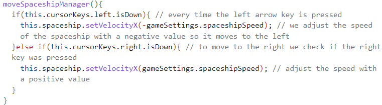
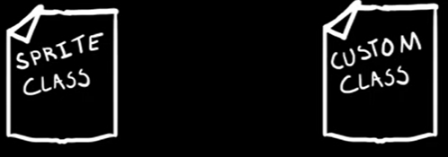
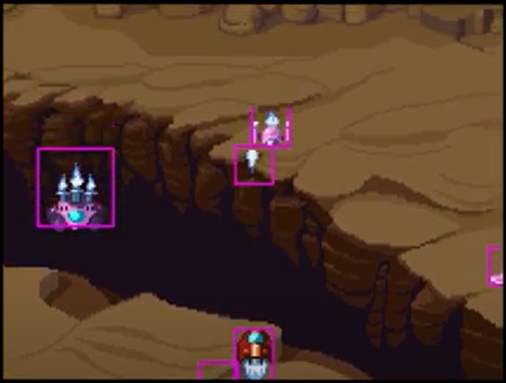
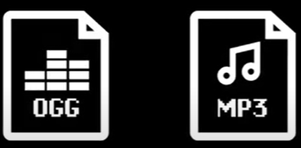

# Entry 3: Learning My Tool Over The Winter Break
##### 2/3/2025

## Content: Learning My Tool Over The Winter Break

From December 20 to January 1, I have been learning my tool **Phaser**. I finished the [YouTube Tutorial](https://www.youtube.com/playlist?list%3DPLDyH9Tk5ZdFzEu_izyqgPFtHJJXkc79no). While watching the tutorials, I took notes and tinkered in my IDE.

On January 6 and January 12, I watched a YouTube tutorial on [How To Make A PhaserJS Game! | Simple Tutorial](https://youtu.be/88DS3Z8nOdY?si=5UAOESxUAQtBTp22). While watching the tutorial, I took notes and tinkered in my IDE.

### My Notes In My Learning Log

### 12/31/2024 & 1/1/2025

#### Part 7 Keyboard Input

Link to the video: [Part 7 Keyboard Input](https://youtu.be/KQ2FhPKBOHI?si=L9USwpxzz_8UNtv5).

Link to the Tinkering: https://github.com/nancyc0337/sep11-freedom-project/tree/main/tool/tinkering-7a

Notes:

`this.background.tilePositionY -= 0.5;` moves the background on the y-axis in infinite loop

#### Part 8 Custom Classes

Link to the video: [Part 8 Custom Classes](https://youtu.be/qs5xmT6Upsc?si=fP__B527A74ynSG1).

Link to the Tinkering: https://github.com/nancyc0337/sep11-freedom-project/tree/main/tool/tinkering-7b

Notes:

* we can create an exact copy that we can customize
* In this new class(custom classes), we can define specific methods and properties

#### Part 9 Collisions

Link to the video: [Part 9 Collisions](https://youtu.be/hkedWHfU_oQ?si=O4smaZXWkPZqy040).

Link to the Tinkering: https://github.com/nancyc0337/sep11-freedom-project/tree/main/tool/tinkering-7c

Notes:

* Phaser can calculate when a object collides or overlaps with another

#### Part 10 Score Label

Link to the video: [Part 10 Score Label](https://youtu.be/a17P2A4Bgko?si=GogrMz9MofVEwiy8).

Link to the Tinkering: https://github.com/nancyc0337/sep11-freedom-project/tree/main/tool/tinkering-7d

Notes:
Bitmap font = a spritesheet containing font symbols in a PNG file

**Create own Bitmap font files with Littera**

Littera Tutorial: https://www.joshmorony.com/adding-custom-fonts-to-your-phaser-game/

#### Part 11 Feedback

Link to the video: [Part 11 Feedback](https://youtu.be/hJ91bkJPdH0?si=U3mfb4D0UWoUPi3H).

Link to the Tinkering: https://github.com/nancyc0337/sep11-freedom-project/tree/main/tool/tinkering-7e

Notes:
* Feedback means to notify the players that something actually happened in the game

#### Part 12 Audio

Link to the video: [Part 12 Audio](https://youtu.be/COncYQLGJS8?si=o9er2C1VTY_6Cqhx).

Link to the Tinkering: https://github.com/nancyc0337/sep11-freedom-project/tree/main/tool/tinkering-7f

Notes:
* We can add sounds & music to our phaser game!
* Phaser support MP3 and OGG audio files

### 1/6/2025 & 1/12/2025

#### How To Make A PhaserJS Game! | Simple Tutorial

Link to the video: [How To Make A PhaserJS Game! | Simple Tutorial](https://youtu.be/88DS3Z8nOdY?si=5UAOESxUAQtBTp22).

Link to the Tinkering: https://github.com/nancyc0337/sep11-freedom-project/tree/main/tool/tinkering-8

Notes:

**important functions: preload(){}, create(){}, update(){}**

preload function have:
* `load.image('', 'path to image')`
* `load.spritesheet('', 'path to image')`

create function have:
* physics (gravity)
* add sprites
* game objects

update function have:
* makes the magic happen
* physics
* make alerts (alert("___"))
* if else & for loops

## Sources

My first resource is from my IDE/Github, where I stored & tinkered with my tool (tool folder): [Link To My Tool Folder](https://github.com/nancyc0337/sep11-freedom-project/tree/main/tool).

My second resource is from my IDE/Github, where I wrote down my progress of what I did with my tool: [Link To My Learning Log](https://github.com/nancyc0337/sep11-freedom-project/blob/main/tool/learning-log.md).

My third resource is a Phaser Tutorials playlist from Youtube that Mr. Mueller put in his document SEP11 Freedom Project Tool List: [Link To The Phaser Tutorials playlist from Youtube](https://www.youtube.com/playlist?list=PLDyH9Tk5ZdFzEu_izyqgPFtHJJXkc79no).

## Engineering Design Process

Right now in the Engineering Design Process(EDP), I am on the 5th step(Create a prototype). Currently, we are using many resources to learn our tool to make our project. I think I'll be on 6th step(Test and evaluate the prototype), using what we learned about our tool to create our game. But before the 6th step(Test and evaluate the prototype), I'll talk to my partner Simran Sayeed to discuss more on the game's functions, layout and more.

## Skills

1) Debugging

The 1st skill I learned during this process is **Debugging**.

When coding with Phaser, details are very important, if there's any small errors, the result wouldn't appear or the whole thing would collapse. I also have to know where the specific code goes:

For example:

### 1/6/2025 & 1/12/2025

#### How To Make A PhaserJS Game! | Simple Tutorial

Link to the video: [How To Make A PhaserJS Game! | Simple Tutorial](https://youtu.be/88DS3Z8nOdY?si=5UAOESxUAQtBTp22).

Link to the Tinkering: https://github.com/nancyc0337/sep11-freedom-project/tree/main/tool/tinkering-8

Notes:

**important functions: preload(){}, create(){}, update(){}**

preload function have:
* `load.image('', 'path to image')`
* `load.spritesheet('', 'path to image')`

create function have:
* physics (gravity)
* add sprites
* game objects

update function have:
* makes the magic happen
* physics
* make alerts (alert("___"))
* if else & for loops

2) Problem decomposition & Organization

The 2nd and 3rd skill I learned during this process is **Problem decomposition** & **Organization**.

Over the break, I decided to finish the [tutorial playlist](https://www.youtube.com/playlist?list=PLDyH9Tk5ZdFzEu_izyqgPFtHJJXkc79no). So I had to break the task down into smaller pieces. I had to organize myself by watching the video, taking down notes in my [learning log](https://github.com/nancyc0337/sep11-freedom-project/blob/main/tool/learning-log.md) and tinkering with the code.

## Summary

In conclusion, I will use what I learned about Phaser to create a music and math game with Simran.

[Previous](entry02.md) | [Next](entry04.md)

[Home](../README.md)
