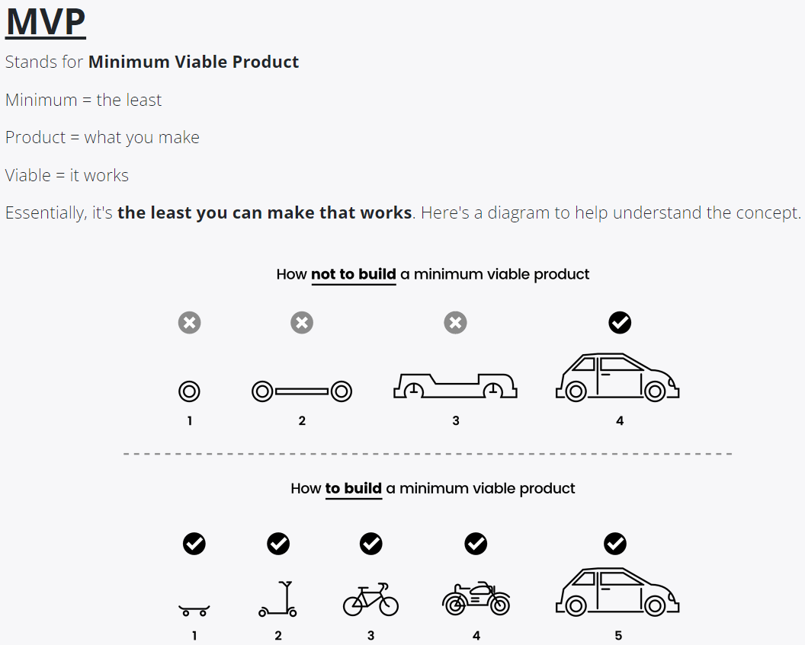
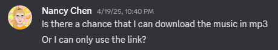
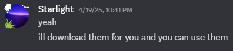
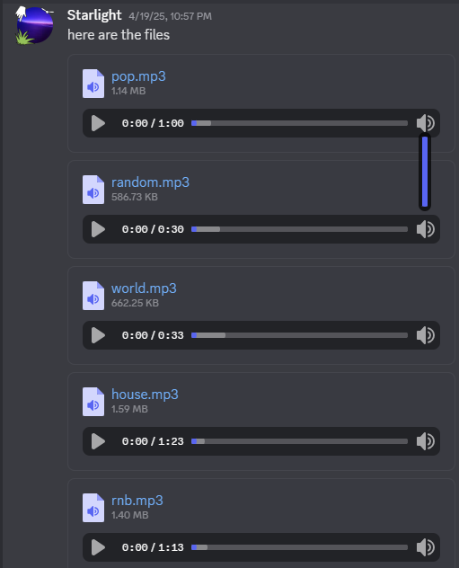

# Entry 5: Finishing Our MVP (Minimum Viable Product)
##### 4/27/2025

## Content: How We Finished Our MVP (Minimum Viable Product)

From March 10 to April 20, Simran and I worked towards our MVP (Minimum Viable Product).

We worked on our code for our Harmony Quest math & music game.

[Link To Our Harmony Quest Game Code](https://github.com/simrans4258/music-game/tree/main)

[Link To Our Harmony Quest Game (Product)](https://simrans4258.github.io/music-game/)

I worked on the game part using Phaser. My partner Simran, worked on the music part using EarSketch.

She sent me her link to her music.

[First Link To Her Music](https://earsketch.gatech.edu/earsketch2/?sharing=sJofaPkVAFacF9qah6U0sw)
[Second Link To Her Music](https://earsketch.gatech.edu/earsketch2/?sharing=mMnc0kl_hpBlouIoSmUzQA)
[Third Link To Her Music](https://earsketch.gatech.edu/earsketch2/?sharing=WlIuL5eON1uG6ilE5frDVg)
[Fourth Link To Her Music](https://earsketch.gatech.edu/earsketch2/?sharing=6RUq-vYFHsDSki1kbHMugw)
[Fifth Link To Her Music](https://earsketch.gatech.edu/earsketch2/?sharing=_gGHsvc6BDkde-hPHHbgDw)

She helped me download the music to a mp3 file so I can use the mp3 files in the code.

During my process coding with Phaser, I ran into lots of challenges:

## Sources

My first resource is from my IDE/Github, where I make my music-game: [Link To Our Music & Math Game Code](https://github.com/simrans4258/music-game/tree/main).

My second resource is from my IDE/Github, where I wrote down my progress of what I did with my tool: [Link To My Learning Log](https://github.com/nancyc0337/sep11-freedom-project/blob/main/tool/learning-log.md).

My third resource is from my IDE/Github, where I tinkered with Phaser: [Link To My SEP Freedom Project Tinkering 7f](https://github.com/nancyc0337/sep11-freedom-project/blob/main/tool/tinkering-7f/game.js).

My fourth resource is from my IDE/Github, where I tinkered with Phaser: [Link To My SEP Freedom Project Tinkering 8](https://github.com/nancyc0337/sep11-freedom-project/blob/main/tool/tinkering-8/public/src/game.js).

My fifth resource is a website about Phaser: [Link To Phaser.io](https://phaser.io/).

My sixth source is Discord & Slack, where I can communicate & collaborate with my partner Simran: [Discord.com](https://discord.com/) & [Slack.com](https://slack.com/).

My seventh resource is from a website, where it helped me understand more about the concept of Phaser audio: [Link To The Phaser Audio](https://docs.phaser.io/phaser/concepts/audio).

My eighth resource is from a blog, where it showed me on how to select more than one character: [Link To The Select More Than One Character Blog](https://blog.ourcade.co/posts/2020/phaser-3-player-select-choose-character/).

My ninth resource is from a blog, where it showed me on Phaser buttons: [Link To The Phaser Buttons Blog](https://blog.ourcade.co/posts/2020/container-button-phaser-3-typescript-rxjs/).

## Engineering Design Process

Right now in the Engineering Design Process(EDP), I am on the 5th step(Create a prototype) and the 6th step(Test and evaluate the prototype). We are using what we learned about our tool to create our [product](https://simrans4258.github.io/music-game/). Before finishing the product and moving on to the 8th step(Communicate the results), we will do the 7th step(Improve as needed).

## Skills

1) Problem decomposition

2) Debugging

3) Communication & Collaboration

## Summary

In conclusion, I will continue to work on the Beyond MVP with Simran to make our Harmony Quest game even better. I can't wait to show my final result of our [game](https://simrans4258.github.io/music-game/)!

[Previous](entry04.md) | [Next](entry06.md)

[Home](../README.md)
