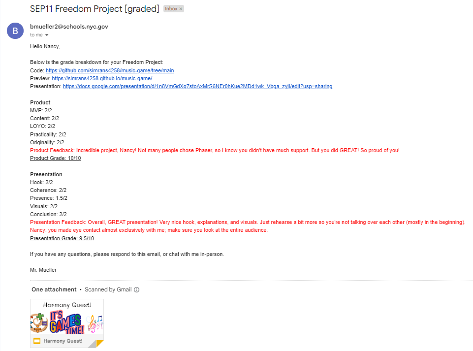

# Entry 6: Takeaways
##### 5/27/2025

## Content: Takeaways

### Expo Elevator Pitch
On May 23-26, we made our elevator pitch.
Elevator Pitch is a short, persuasive speech that one gives in order to create interest in something.

### In-class Presentations
During 5/19-5/22 and 5/27-5/29, my classmates and I presented our projects in front of the class. I presented on 5/22/2025.

Since Simran has 3rd period SEP 11, I went to her 3rd period to present with her. Since I had 4th period SEP 11, she went to my 4th period to present with me. In short, we presented twice to show both periods of what we made.

My teacher (Mr. Mueller)'s comment:

Takeaways:

From giving my SEP Expo elevator pitch and my in-class presentation, I learned
the skill `communication` and `collaboration`. During my SEP Expo and my in-class presentation, I was nervous. But I feel good and proud after showing others what I have made.

## Sources

These are my sources (Link to my elevator pitch & Link to my presentation):

[My Link to My Freedom Project Expo Slide-Elevator Pitch](https://docs.google.com/presentation/d/1fiiGwDneOcq7qFOyWl9ZWOMyWaCc0u32ZIi8cPzMZgI/edit?slide=id.g35db0167b06_0_13#slide=id.g35db0167b06_0_13)

[My Link to My Freedom Project In Class Presentation Slide](https://docs.google.com/presentation/d/1n8VmGdXq7stoAxMrS6NEr0hKue2MDd1wk_Vbga_zyjI/edit?slide=id.p#slide=id.p)

## Engineering Design Process

Right now in the Engineering Design Process(EDP), I am on the 8th (Communicate the results) step. We presented our SEP Freedom Projects to our classmates, teachers, judges, etc.

[My Link to My Freedom Project Expo Slide-Elevator Pitch](https://docs.google.com/presentation/d/1fiiGwDneOcq7qFOyWl9ZWOMyWaCc0u32ZIi8cPzMZgI/edit?slide=id.g35db0167b06_0_13#slide=id.g35db0167b06_0_13)

[My Link to My Freedom Project In Class Presentation Slide](https://docs.google.com/presentation/d/1n8VmGdXq7stoAxMrS6NEr0hKue2MDd1wk_Vbga_zyjI/edit?slide=id.p#slide=id.p)

## Skills

1) Communication & Collaboration

The first & second skill I learned during this process is **Communication** and **Collaboration**.

The skill Communication is about articulating ideas to your partner, writing in your portfolio, public speaking in presentations, etc. The skill Collaboration is about self-advocacy (asking for help), give/take within pair programming, etc. Simran & I presented our elevator pitch in the SEP Expo and presentation in-class presentation(public speaking).

## Summary
In conclusion, I'm proud of what I made with Simran. I'm happy to accomplish this far with my partner.

I'm also thankful for the opportunity. After the SEP expo & on May 29, Mr. Mueller told us the ones that got the honorable mention and the 3 finalists that will present to others about our work. This year, Simran & I is one of the 3 finalists for SEP 11 Freedom Project! On June 6, Simran & I will present in the auditorium, periods 2 & 3 in front of students, teachers, friends, alumni, etc. Thanks Mr. Mueller. 

[Previous](entry05.md)

[Home](../README.md)

