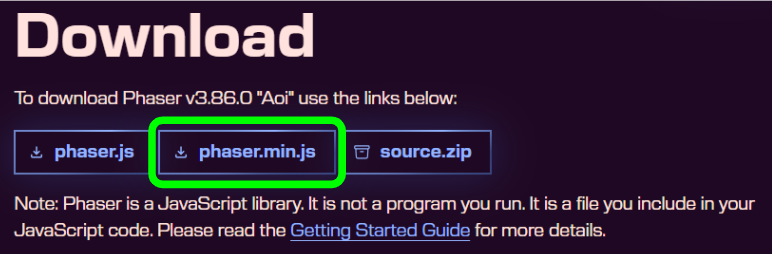
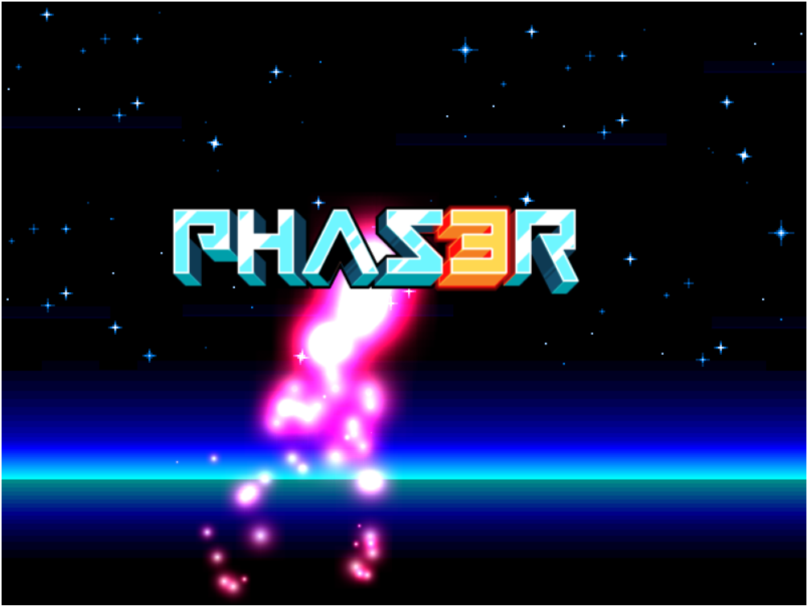
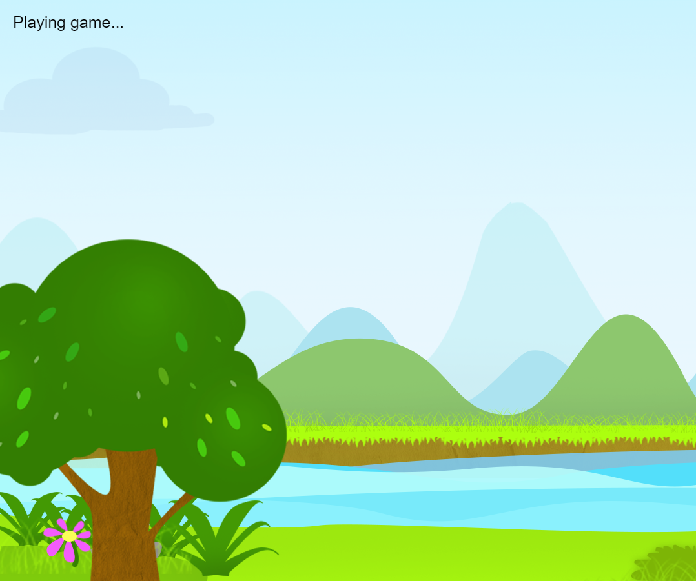
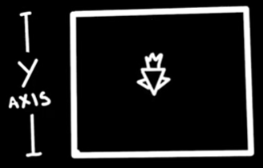
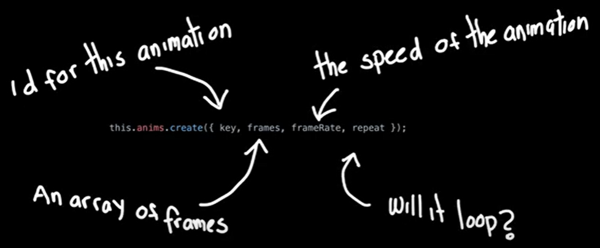
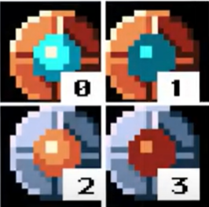
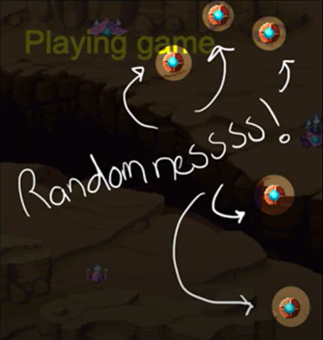
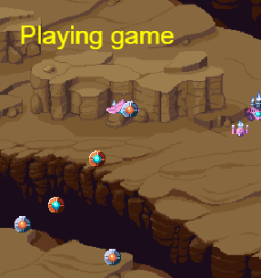
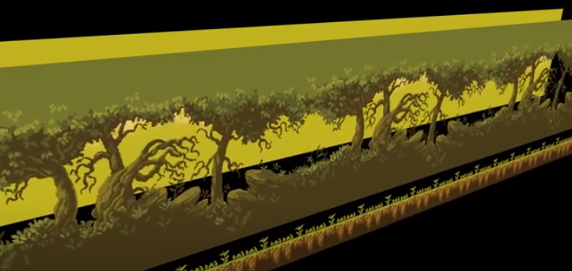

# Tool Learning Log

## Tool: **Phaser**

## Project: **X**

### 10/20/2024: Setting Up & Scenes

#### Part 1: Setting Up
Link to the video: [Part 1 Setting Up](https://youtu.be/frRWKxB9Hm0?si=TihtknpL4Fswe1w1)

All About Phaser Notes:
* Phaser uses javascript to create games very quickly
* is very versatile
* can make different kinds of 2D games

My steps to download Phaser:
1) I downloaded Phaser from [phaser.io/download/stable](phaser.io/download/stable)
2) I only downloaded the phaser.min.js file

3) I dragged the file into my IDE when it's done downloading

Notes For Coding With Phaser:
1) To view my codes/see the output or result, I use `http-server` and go to index.html file.
2) In the beginning, I should be seeing a black screen. That black screen is the game canvas. It's where the magic happens, where I can see my game.
3) I can use `inspect` and go to the console to see if there's any output errors.

#### Creating & Checking

Link to the Website: https://phaser.io/tutorials/getting-started-phaser3/part5

Link to the Tinkering: https://github.com/nancyc0337/sep11-freedom-project/tree/main/tool/tinkering-1a

I created an index.html file, copied and pasted the code in it. When I tested it with `http-server`, it shows:


#### Part 2: Scenes

Link to the Video: [Part 2 Phaser Scenes](https://youtu.be/gFXx7lgxK9A?si=AdQ-MX8mEFOlB-Ix)

Link to the Tinkering: https://github.com/nancyc0337/sep11-freedom-project/tree/main/tool/tinkering-1b

Notes:
* `width` changes the x-axis of the shape
* `height` changes the y-axis of the shape
* `backgroundColor` changes the color of the background

Scene Notes:
* Phaser use scenes to organize its content
* scenes are places where the elements of the game live in
* I can create as many scenes as I want!
* I can have several scenes running at the same time in the same game!

Types of Functions that controlls the scenes:
* `INIT()` function is used to prepare data
* `PRELOAD()` function is used to load the music and images into memory
* `CREATE()` function is used to add the objects to the game
* `UPDATE()` function is an update, which is a loop that runs constantly

##### A-ha moments:
When I typed the code into the files scene1.js and scene2.js, and tried to switch scenes, the result didn't change. It just stayed as the 1st scene. After I watched the video again, I saw the problem. I didn't type `this.scene.start("playGame");` in scene1.js. I learned that this code helps the game jump from scene1 to scene2. Scene1 shows red background with white/transparent text saying "Loading game...". Scene 2 shows red background with "font: 25px, Arial" yellow text saying "Playing game".

##### Next Step
I will learn [Part 3 Game Objects Images](https://youtu.be/l65rEEdgURA?si=spl8FgUaZ0yzJNWr).

### 10/27/2024:

#### Part 3: Game Objects Images

Link to the Video: https://youtu.be/l65rEEdgURA?si=1GlWWAUG16tk_4MT

Link to the Tinkering: https://github.com/nancyc0337/sep11-freedom-project/tree/main/tool/tinkering-2a

I tried to use a different image/background from the video.

The challenge that I had was uploading the background. At first I didn't see the background when I tried `http-server`. But after looking and tinkering with the codes, I see that the files game.js, scene1.js and scene2.js was the problem.

I learned to pay attention to detail, especially to my codes or I will not see my output/result that I wanted.

Notes/A-ha moment:

* `this.load.image("key","url");`

KEY: A string to identify the image

URL: A string path to the image file

* `this.add.image(0,0,"background");`

POSITION: the x and y coordinates for the image

KEY: the name of image defined when loaded

My result of my tinkering:


##### Next Step
I will learn [Part 4 Moving Images](https://youtu.be/jVlNZgX5fV8?si=8DX8YCn0WSZ5xWjU) and [Part 5 Spritesheets](https://youtu.be/U0K0YTifb1w?si=qKh0OpInCnVqsoFM).

### 11/11/2024

#### Part 4: Moving Images

Link to the video: [Part 4 Moving Images](https://youtu.be/jVlNZgX5fV8?si=8DX8YCn0WSZ5xWjU)

Link to the Tinkering: https://github.com/nancyc0337/sep11-freedom-project/tree/main/tool/tinkering-3a

Notes:
* to move the sprite on the vertical axis, increase the Y value
* we can move the sprite back to the top of the screen when it reaches the bottom of the screen

* to make the background scroll more appealing, change the image to TileSprite
    * TileSprite is a sprite that has a repeating texture

Code Notes/Explanation:
```js
var randomX = Phaser.Math.Between(0, config.width);
alien.x = randomX;
```
This creates a random value between zero and the width of the game and assigns to the alien X value position

#### Part 5: Spritesheets

Link to the video: [Part 5 Spritesheets](https://youtu.be/U0K0YTifb1w?si=qKh0OpInCnVqsoFM)

Link to the Tinkering: https://github.com/nancyc0337/sep11-freedom-project/tree/main/tool/tinkering-3b

What I made: when clicked, the aliens are destroyed => shows explosion

Notes:
* In order to make animations in Phaser, we need to use spritesheets
* A "Spritesheet" is a collection of images in a single file separated by frames
* Like in a movie cell, each frame has the same size as the previous one

Code Notes/Explanation:

* `Repeat` tells me how many times it will loop
 * infinite loops: use -1
* if we want the animation to disappear, we'll want it to run once
 * set the `Repeat` to 0 and set the `hideOnComplete` to true

##### Next Step
I will learn [Part 6 Physics](https://youtu.be/cuSQnbZloFc?si=PxrHsAOctcY3Ao1L).

### 11/18/2024

#### Part 6: Physics

Link to the video: [Part 6 Physics](https://youtu.be/cuSQnbZloFc?si=PxrHsAOctcY3Ao1L)

Link to the Tinkering: https://github.com/nancyc0337/sep11-freedom-project/tree/main/tool/tinkering-4a

Video Notes:
* physics engine is necessary for simulate gravity, velcity, collisions, etc

Code Notes:

```js
physics: {
    default: "arcade",
    arcade:{
        debug: false
    }
  }
}
```
Explanation: enables game to support physics, debug to false

```js
start: 0,
end: 1
```
```js
start: 2,
end: 3
```
Explanation: creates 2 game objects with the same sprite file



`setRandomPosition` creates random positions



```js
if (Math.random() > 0.5) {
    powerUp.play("red");
} else {
    powerUp.play("gray");
}
```
Explanation: 50-50 chance to play either red or gray animations

`powerUp.setCollideWorldBounds(true);` sets boundaries

`powerUp.setBounce(1);` sets the sprite bounce like rubber balls
* higher value = extra bounciness!

What I tinkered with:

The balls/spheres will bounce around, while the ships travels downward. We can also destroy the ships by clicking them.



##### Next Step
I will learn [Parallax Scrolling TileSprite](https://youtu.be/pknZUn82x2U?si=xEgYjkf8I-ND1ZMp).

### 12/2/2024
#### Parallax Scrolling

Link to the video: [Parallax Scrolling](https://youtu.be/pknZUn82x2U?si=xEgYjkf8I-ND1ZMp).

Link to the Tinkering: https://github.com/nancyc0337/sep11-freedom-project/tree/main/tool/tinkering-5a

Video Notes:
* Parallax Scrolling is a technique in computer graphics where background images move past the camera more slowly than forebackground images creating an illusion of depth in a 2D scene.


Code Notes:

1st step:
* upload image & add it as tileSprite
* define its width and height with the same dimensions as the game screen

Example:

`this.background = this.add.tileSprite(0, 0, game.config.width, game.config.height, "background");`

The image will stretch & pattern is repeated across the screen.

**Define the origion to the top-left corner of the image and fix its position to prevent it from moving**

Example:

```js
this.background.setOrigin(0, 0);
this.background.setScrollFactor(0);
```

2nd step:
* add a player and a camera
* tell camera to follow the player

Code: `this.cameras.main.startFollow(this.player);`

3rd step:
* change the texture of the background proportionally to the position of the camera in the update
* repeat for each layer that I want to add to the background

Code: `this.background.tilePositionX = this.myCam.scrollX * .3;`

Takeaway:
* I accidentally put `this.background.tilePositionX = this.myCam.scrollX * .3;` in the create function. `this.background.tilePositionX = this.myCam.scrollX * .3;` supposed to be in the update function.

Skill: Attention to detail & Debugging

##### Next Step

I will learn [Part 7 Keyboard Input](https://youtu.be/KQ2FhPKBOHI?si=50hpfLgESr1J4_AU).

### 12/31/2024

#### Part 7 Keyboard Input

Link to the video: [Part 7 Keyboard Input](https://youtu.be/KQ2FhPKBOHI?si=L9USwpxzz_8UNtv5).

Link to the Tinkering: https://github.com/nancyc0337/sep11-freedom-project/tree/main/tool/tinkering-7a

#### Part 8 Custom Classes

Link to the video: [Part 8 Custom Classes](https://youtu.be/qs5xmT6Upsc?si=fP__B527A74ynSG1).

Link to the Tinkering: https://github.com/nancyc0337/sep11-freedom-project/tree/main/tool/tinkering-7b

#### Part 9 Collisions

Link to the video: [Part 9 Collisions](https://youtu.be/hkedWHfU_oQ?si=O4smaZXWkPZqy040).

Link to the Tinkering: https://github.com/nancyc0337/sep11-freedom-project/tree/main/tool/tinkering-7c

#### Part 10 Score Label

Link to the video: [Part 10 Score Label](https://youtu.be/a17P2A4Bgko?si=GogrMz9MofVEwiy8).

Link to the Tinkering: https://github.com/nancyc0337/sep11-freedom-project/tree/main/tool/tinkering-7d

#### Part 11 Feedback

Link to the video: [Part 11 Feedback](https://youtu.be/hJ91bkJPdH0?si=U3mfb4D0UWoUPi3H).

Link to the Tinkering: https://github.com/nancyc0337/sep11-freedom-project/tree/main/tool/tinkering-7e

#### Part 12 Audio

Link to the video: [Part 12 Audio](https://youtu.be/COncYQLGJS8?si=o9er2C1VTY_6Cqhx).

Link to the Tinkering: https://github.com/nancyc0337/sep11-freedom-project/tree/main/tool/tinkering-7f

<!--
* Links you used today (websites, videos, etc)
* Things you tried, progress you made, etc
* Challenges, a-ha moments, etc
* Questions you still have
* What you're going to try next
-->
